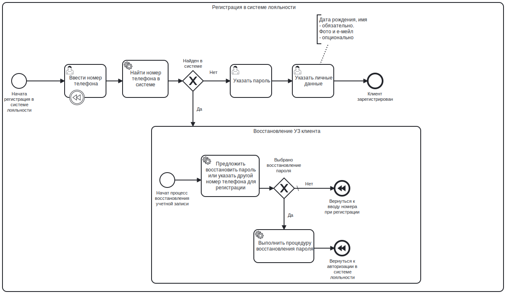
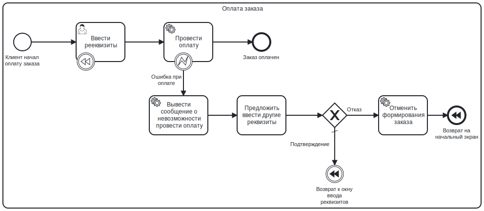

# Описание бизнес-процессов

## Взаимодействие клиента с системой

На схеме представлены следующие бизнес-процессы:

- Формирование, оплата заказа пользователем и его получение
- Регистрация пользователя, авторизация клиента в системе лояльности, ее использование
- Решение пользовательских проблем при помощи менеджера по гостеприимству

## Детализация подпроцессов

### Регистрация пользователя в системе лояльности

На схеме представлен подпроцесс регистрации пользователя в системе лояльности состоящий их следующих элементов:

- Регистрация пользователя в системе лояльности
- Восстановление пароля от УЗ

### Оплата заказа пользователем

На схеме представлен подпроцесс оплаты заказа пользователем

